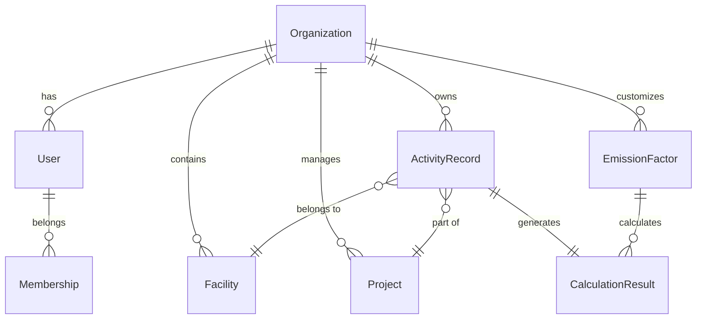
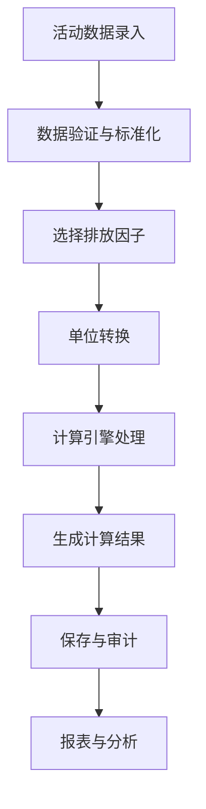

# 碳排放计算系统 (Carbon Emission Calculator)

遵循 GHG Protocol 的企业级碳排放计算平台，支持 Scope 1/2/3 全范围碳核算。

[](https://github.com/carbon-calculator/carbon)
[](LICENSE)
[](https://nodejs.org)
[](https://www.typescriptlang.org)

## 🌟 特性

### 💼 业务功能
- **完整碳核算** - 支持 Scope 1/2/3 全范围排放计算
- **多租户架构** - 组织级隔离，支持成员权限管理 (RBAC)
- **灵活计算引擎** - 可扩展的计算器框架，支持自定义排放因子
- **数据质量管理** - 支持测量、计算、估算三级数据质量标识
- **批量数据处理** - CSV/Excel 导入导出，批量计算功能
- **实时报表** - 多维度统计分析，可视化图表展示

### 🏗️ 技术特性
- **现代化技术栈** - React 18 + NestJS + TypeScript + Prisma
- **企业级架构** - Monorepo + 微服务 + 容器化部署
- **国际化支持** - 中英文双语，可扩展更多语言
- **API 优先** - OpenAPI/Swagger 文档，RESTful 设计
- **安全可靠** - JWT 认证，审计日志，数据加密
- **云原生** - Docker 容器化，K8s 部署，CI/CD 自动化

## 🚀 快速开始

### 环境要求

- **Node.js** >= 18.0.0
- **pnpm** >= 8.0.0
- **Docker** >= 20.10.0
- **Docker Compose** >= 2.0.0

### 一键启动

```bash
# 1. 克隆项目
git clone https://github.com/carbon-calculator/carbon.git
cd carbon

# 2. 安装依赖
pnpm install

# 3. 启动开发环境 (仅基础服务)
.\scripts\start.ps1 dev
# 或 Linux/macOS: ./scripts/start.sh dev

# 4. 启动开发服务器
# 后端 API
cd apps/api
pnpm dev

# 前端 Web (新终端)
cd apps/web  
pnpm dev
```

## 🖥️ 本机启动演示

### 方式一：快速体验（推荐）

如果您想快速体验系统功能，无需复杂配置：

```powershell
# Windows 用户
# 1. 克隆或下载项目到本地
git clone https://github.com/carbon-calculator/carbon.git
cd carbon

# 2. 安装 Node.js 依赖（如果没有 pnpm，先安装：npm install -g pnpm）
npm install  # 使用 npm 也可以

# 3. 启动前端应用（仅前端演示）
cd apps/web
npm install
npm run dev

# 4. 打开浏览器访问 http://localhost:3000
# 点击"登录"按钮，使用以下演示账号：
# 管理员：admin@carbon.example.com / admin123
```

```bash
# Linux/macOS 用户
# 1. 克隆项目
git clone https://github.com/carbon-calculator/carbon.git
cd carbon

# 2. 安装依赖
npm install

# 3. 启动前端
cd apps/web
npm install  
npm run dev

# 4. 访问 http://localhost:3000 体验
```

### 方式二：完整系统演示

如果您想体验完整的前后端功能：

#### 前提条件
- Docker 和 Docker Compose（用于数据库）
- Node.js >= 18.0.0
- pnpm >= 8.0.0（推荐）或 npm

#### 启动步骤

```powershell
# Windows 完整启动
# 1. 启动数据库服务
.\scripts\start.ps1 dev  # 启动 PostgreSQL 和 pgAdmin

# 2. 启动后端 API（新终端窗口）
cd apps/api
npm install
npm run prisma:push    # 初始化数据库
npm run prisma:seed    # 导入示例数据
npm run dev           # 启动后端服务

# 3. 启动前端应用（新终端窗口）
cd apps/web
npm install
npm run dev           # 启动前端服务
```

```bash
# Linux/macOS 完整启动
# 1. 启动数据库
./scripts/start.sh dev

# 2. 启动后端（新终端）
cd apps/api
npm install
npm run prisma:push
npm run prisma:seed  
npm run dev

# 3. 启动前端（新终端）
cd apps/web
npm install
npm run dev
```

### 方式三：Docker 一键启动

最简单的方式，无需配置 Node.js 环境：

```bash
# 确保安装了 Docker 和 Docker Compose
# 1. 克隆项目
git clone https://github.com/carbon-calculator/carbon.git
cd carbon

# 2. 一键启动所有服务
docker-compose -f infra/docker/docker-compose.yml up -d

# 3. 等待服务启动完成（约2-3分钟）
# 访问 http://localhost:3000
```

### 🎯 演示流程建议

启动成功后，按以下流程体验系统：

1. **登录系统**
   - 访问 http://localhost:3000
   - 点击"管理员账号"快速登录
   - 或手动输入：admin@carbon.example.com / admin123

2. **浏览仪表板**
   - 查看碳排放概览统计
   - 了解快捷操作入口

3. **添加活动数据**
   - 点击"活动数据"菜单
   - 添加电力消耗记录（如：1000 kWh）
   - 查看数据质量标识

4. **进行碳排放计算**
   - 进入"碳排放计算"页面
   - 选择"电力消耗"类型
   - 输入数量和单位
   - 查看计算结果和排放分解

5. **查看分析报表**
   - 访问"报表分析"页面
   - 查看 Scope 1/2/3 分布
   - 了解排放趋势图表

6. **管理组织设置**
   - 进入"组织管理"页面
   - 查看成员管理功能
   - 调整组织设置

### ⚠️ 常见问题

**前端启动失败**
```bash
# 如果遇到依赖问题，清除缓存重新安装
rm -rf node_modules package-lock.json  # Linux/macOS
Remove-Item -Recurse -Force node_modules, package-lock.json  # Windows
npm install
```

**后端API连接失败**
- 前端使用模拟登录，无需后端也可体验基础功能
- 如需完整功能，确保后端服务正常启动在 3001 端口

**Docker 启动失败**
```bash
# 检查端口占用
netstat -ano | findstr :3000  # Windows
lsof -i :3000  # Linux/macOS

# 停止并清理 Docker 服务
docker-compose -f infra/docker/docker-compose.yml down
```

### 访问地址

- **前端应用**: http://localhost:3000
- **后端 API**: http://localhost:3001
- **API 文档**: http://localhost:3001/api/docs
- **数据库管理**: http://localhost:5050

### 演示账号

```
管理员: admin@carbon.example.com / admin123
经理: manager@carbon.example.com / manager123
成员: member@carbon.example.com / member123
```

## 📋 项目结构

```
carbon/
├── apps/                           # 应用程序
│   ├── api/                        # 后端 API (NestJS)
│   │   ├── src/
│   │   │   ├── auth/              # 认证模块
│   │   │   ├── calculations/      # 计算引擎
│   │   │   ├── organizations/     # 组织管理
│   │   │   ├── activity-records/  # 活动数据
│   │   │   ├── emission-factors/  # 排放因子
│   │   │   └── reports/           # 报表模块
│   │   ├── prisma/                # 数据库模型
│   │   └── test/                  # 测试文件
│   └── web/                       # 前端应用 (React)
│       ├── src/
│       │   ├── components/        # UI 组件
│       │   ├── pages/             # 页面组件
│       │   ├── hooks/             # 自定义 Hooks
│       │   ├── services/          # API 服务
│       │   └── utils/             # 工具函数
│       └── public/                # 静态资源
├── packages/                      # 共享包
│   ├── types/                     # 类型定义
│   ├── ui/                        # UI 组件库
│   └── config/                    # 配置文件
├── infra/                         # 基础设施
│   ├── docker/                    # Docker 配置
│   ├── k8s/                       # Kubernetes 配置
│   └── db/                        # 数据库脚本
├── scripts/                       # 脚本文件
└── docs/                          # 文档
```

## 🎯 核心概念

### 数据模型关系



### 计算流程



## 🧮 计算引擎

### 支持的活动类型

| Scope | 类别 | 活动类型 | 描述 |
|-------|------|----------|------|
| Scope 1 | 固定燃烧 | `natural_gas`, `diesel`, `gasoline` | 燃料燃烧排放 |
| Scope 2 | 电力 | `electricity` | 外购电力排放 |
| Scope 3 | 商务出行 | `flight_*`, `road_freight` | 差旅和运输排放 |
| Scope 3 | 废弃物 | `waste_*` | 废弃物处理排放 |

### 计算公式

```typescript
// 基础公式
emissions(tCO2e) = activityAmount × emissionFactor × unitConversion × GWP

// 电力计算 (地点法)
emissions = kWh × gridEmissionFactor(kgCO2e/kWh) / 1000

// 燃料燃烧
emissions = fuelAmount × carbonContent × oxidationFactor × (44/12) / 1000

// 航班排放
emissions = passengerKm × flightFactor × cabinMultiplier × RFI / 1000
```

### 自定义计算器

```typescript
// 实现 Calculator 接口
export class CustomCalculator extends BaseCalculator {
  getSupportedActivityTypes(): string[] {
    return ['custom_activity'];
  }

  async calculate(input: NormalizedInput, factor: EmissionFactor): Promise<CalculationResult> {
    // 自定义计算逻辑
    const emissions = input.normalizedAmount * factor.factorValue;
    return {
      tCO2e: emissions / 1000,
      breakdown: {
        // 计算明细
      },
      method: 'Custom Calculation',
      dataQuality: 'calculated',
    };
  }
}
```

## 📊 排放因子管理

### 系统内置因子

系统预置了常用的排放因子，包括：
- **中国电网平均排放因子** (0.5810 kg CO2e/kWh, 2023)
- **IPCC 燃料排放因子** (天然气、柴油、汽油等)
- **DEFRA 交通排放因子** (航班、货运等)
- **EPA 废弃物排放因子** (填埋、焚烧、回收等)

### 自定义排放因子

```typescript
// 创建组织自定义排放因子
const customFactor = {
  organizationId: "org-123",
  activityType: "renewable_electricity",
  region: "CN-BJ",
  year: 2024,
  factorValue: 0.0, // 可再生能源零排放
  factorUnit: "kg CO2e/kWh",
  source: "CUSTOM",
  reference: "购电协议证明",
  priority: 100, // 高优先级
};
```

### 排放因子优先级

1. **组织自定义因子** (最高优先级)
2. **最新年份因子**
3. **高优先级因子**
4. **默认因子**

## 🔧 开发指南

### 添加新的计算器

1. **创建计算器类**
```typescript
// apps/api/src/calculations/calculators/my-calculator.ts
export class MyCalculator extends BaseCalculator {
  // 实现接口方法
}
```

2. **注册计算器**
```typescript
// apps/api/src/calculations/calculators/calculator-registry.service.ts
constructor(private myCalculator: MyCalculator) {
  this.registerCalculator(this.myCalculator);
}
```

3. **添加测试**
```typescript
// apps/api/src/calculations/calculators/my-calculator.spec.ts
describe('MyCalculator', () => {
  // 测试用例
});
```

### 单位转换

```typescript
// 使用单位转换服务
const converter = this.unitConverter.getConverter('energy');
const kWh = converter.convert(1, 'MWh', 'kWh'); // 1000
```

### API 客户端

```typescript
// 前端调用 API
import { api } from '@/services/api';

const result = await api.calculations.calculate({
  activityType: 'electricity',
  amount: 1000,
  unit: 'kWh',
});
```

## 🧪 系统验证

为了确保系统的完整性，我们提供了自动化验证脚本：

```bash
# 运行系统功能验证
node scripts/validate-system.js

# 或者使用 npm
npm run validate
```

验证内容包括：
- ✅ 项目结构完整性
- ✅ 后端组件和 API 接口
- ✅ 前端页面和组件
- ✅ 共享包和 UI 组件
- ✅ 测试用例覆盖
- ✅ 配置文件和 Docker 设置
- ✅ 核心功能可用性

成功率达到 90% 以上表示系统准备就绪。

## 🧪 测试

```bash
# 运行所有测试
pnpm test

# 测试覆盖率
pnpm test:cov

# E2E 测试
pnpm test:e2e

# 监视模式
pnpm test:watch
```

## 🚀 部署

### Docker 部署

```bash
# 生产环境
.\scripts\start.ps1 prod

# 自定义配置
docker-compose -f infra/docker/docker-compose.yml up -d
```

### Kubernetes 部署

```bash
# 应用配置
kubectl apply -f infra/k8s/

# 检查状态
kubectl get pods -n carbon-system
```

### 云平台部署

项目支持一键部署到：
- **Render** - `render.yaml`
- **Railway** - `railway.json`
- **Fly.io** - `fly.toml`
- **Vercel** - `vercel.json`

## 📈 性能与监控

### 性能指标

- **API 响应时间** < 200ms (P95)
- **数据库查询** < 100ms (P95)
- **批量计算** 1000 条记录 < 10s
- **内存使用** < 512MB
- **并发用户** 支持 1000+

### 监控集成

```yaml
# docker-compose.monitoring.yml
services:
  prometheus:
    image: prom/prometheus
  grafana:
    image: grafana/grafana
  jaeger:
    image: jaegertracing/all-in-one
```

## 🔒 安全

### 认证与授权

- **JWT** 双令牌机制 (Access + Refresh)
- **RBAC** 基于角色的权限控制
- **API 速率限制** 防止滥用
- **CORS** 跨域安全配置

### 数据保护

- **数据加密** 敏感数据存储加密
- **审计日志** 完整操作追踪
- **软删除** 数据恢复机制
- **备份策略** 自动化数据备份

## 🌍 国际化

```typescript
// 添加新语言
// apps/web/src/locales/fr.json
{
  "common": {
    "save": "Enregistrer",
    "cancel": "Annuler"
  }
}

// 使用翻译
const { t } = useTranslation();
return <button>{t('common.save')}</button>;
```

## 🤝 贡献指南

### 开发流程

1. **Fork** 项目
2. **创建特性分支** `git checkout -b feature/amazing-feature`
3. **提交更改** `git commit -m 'feat: add amazing feature'`
4. **推送分支** `git push origin feature/amazing-feature`
5. **创建 Pull Request**

### 提交规范

遵循 [Conventional Commits](https://conventionalcommits.org/) 规范：

```
feat: 新功能
fix: 修复bug
docs: 文档更新
style: 代码格式
refactor: 重构
test: 测试相关
chore: 构建过程或辅助工具的变动
```

### 代码审查清单

- [ ] 代码符合项目风格规范
- [ ] 添加了必要的测试用例
- [ ] 更新了相关文档
- [ ] API 变更添加了版本兼容性
- [ ] 性能影响评估
- [ ] 安全性检查

## 📝 变更日志

查看 [CHANGELOG.md](CHANGELOG.md) 了解详细的版本更新记录。

### v1.0.0 (2024-09-04)

#### 🎉 初始版本
- ✨ 完整的碳排放计算系统
- 🏗️ Monorepo 架构设计
- 🧮 支持 Scope 1/2/3 计算
- 🔐 完整的认证授权系统
- 📊 实时报表和数据分析
- 🐳 Docker 容器化部署
- 📚 完整的 API 文档

#### 🧮 计算器支持
- ⚡ 电力消耗计算器 (地点法/市场法)
- 🔥 燃料燃烧计算器 (天然气/柴油/汽油等)
- ✈️ 航班排放计算器 (舱位/航程调整)
- 🚛 货运排放计算器 (多式联运支持)
- 🗑️ 废弃物处理计算器 (填埋/焚烧/回收)

#### 📊 数据管理
- 📈 活动数据录入与批量导入
- 🧮 排放因子管理 (系统内置+自定义)
- 📋 计算结果存储与追溯
- 📊 多维度统计分析

## 📄 许可证

本项目基于 [MIT 许可证](LICENSE) 开源。

## 🙏 致谢

感谢以下开源项目和标准：

- [GHG Protocol](https://ghgprotocol.org/) - 温室气体核算标准
- [IPCC Guidelines](https://www.ipcc.ch/) - 气候变化评估报告
- [NestJS](https://nestjs.com/) - 企业级 Node.js 框架
- [React](https://reactjs.org/) - 用户界面库
- [Prisma](https://prisma.io/) - 现代数据库工具包

## 📞 支持

如有问题或建议，请通过以下方式联系：

- **GitHub Issues**: [提交问题](https://github.com/carbon-calculator/carbon/issues)
- **邮箱**: support@carbon-calculator.com
- **文档**: [在线文档](https://docs.carbon-calculator.com)
- **社区**: [Discord 频道](https://discord.gg/carbon)

---

**让我们一起为碳中和目标贡献力量！** 🌱

## 🚀 快速体验提醒

如果您是第一次接触这个项目，建议按以下顺序体验：

1. **5分钟快速体验**：使用"方式一"仅启动前端，体验 UI 和模拟登录
2. **完整功能体验**：使用"方式二"启动完整系统，体验前后端交互
3. **生产环境体验**：使用"方式三"Docker 部署，体验容器化部署
4. **系统验证**：运行 `npm run validate` 验证系统完整性

🎯 **演示重点**：
- 📊 现代化的碳排放管理界面
- 🧮 专业的 GHG Protocol 计算引擎 
- 📈 多维度数据分析和可视化
- 🏢 企业级多租户架构
- 🔒 完整的用户权限管理

💡 **提示**：系统设计遵循企业级标准，支持真实的碳核算业务场景。